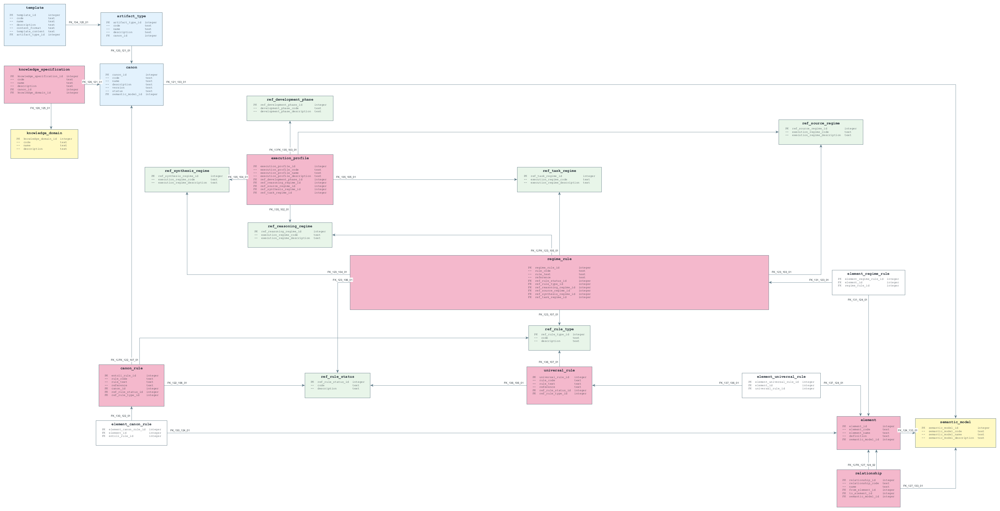
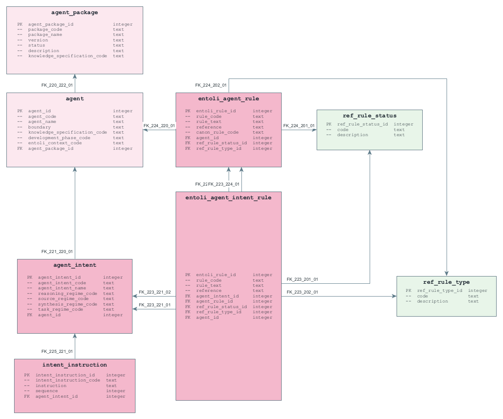
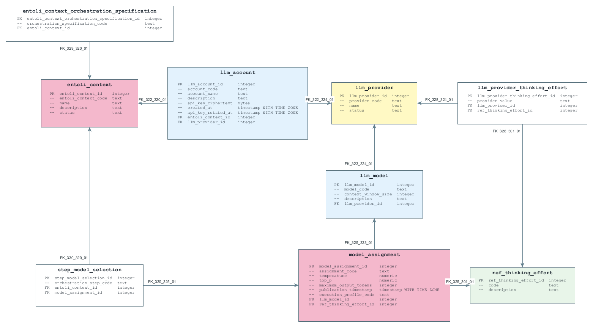
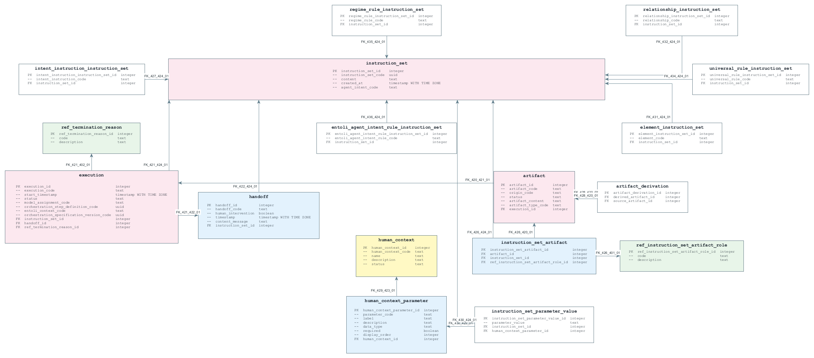
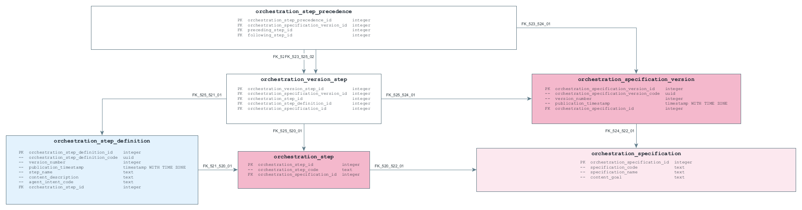

# Diagrammen technisch datamodel

Eén diagram per Logical Instance van het technisch datamodel (TDM). De kleuren van de tabellen staan uitgelegd in de [kleurgids](graphml-colour-guide.md); de tabellen zelf in de [naslag voor ontwikkelaars](tdm-developer-reference.md). Klik op een diagram om het op ware grootte te openen.

## semantic-foundation

## agent-definition

## execution-configuration

## work-execution

## orchestration-definition

