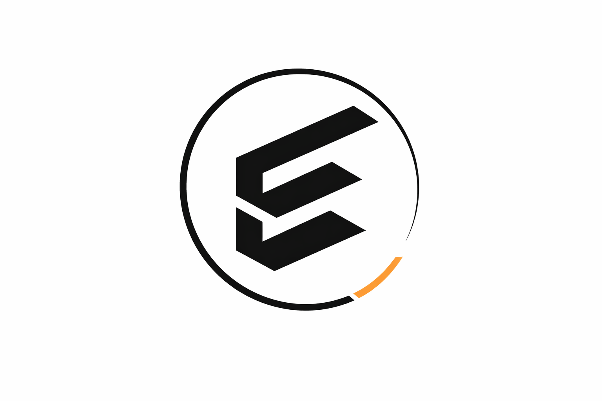

# Eén samenhangend fundament voor kennis, professionele capaciteit en betrouwbare AI-ondersteunde uitvoering

## Van kennis naar uitvoering

### Kennis

Entoli brengt professionele kennis uit bewezen frameworks en standaarden zoals TOGAF, ArchiMate en DAMA samen in één expliciete en gezaghebbende kennisbasis. Deze kennis wordt met een open-sourcecommunity verder ontwikkeld en vormt het fundament voor het integraal uitvoeren van de definitiefase van softwareontwikkeling.

### Capaciteit

Op deze kennis bouwt Entoli herbruikbare professionele capaciteit. Rollen, verantwoordelijkheden en werkwijzen worden expliciet gedefinieerd als Agents die de beschikbare kennis doelgericht inzetten om vraagstukken binnen de definitiefase uit te werken.

### Uitvoering

Deze capaciteit wordt ingezet om van vraag en context tot een samenhangende en onderbouwde definitie te komen van wat gebouwd moet worden. De uitvoering is traceerbaar en beheerst door expliciete kennis en regels, in plaats van afhankelijk te zijn van wat impliciet in één AI-model besloten ligt.

## Soevereiniteit

### Vrij in de keuze van AI-model

Entoli maakt uw kennis en gegevens niet afhankelijk van één AI-leverancier. Het AI-model staat los van de kennis, definities en orchestratie. Daardoor kan ook worden gekozen voor een model dat binnen de eigen omgeving draait, zodat gevoelige gegevens niet met een externe AI-aanbieder hoeven te worden gedeeld.

[Lees meer over soevereiniteit →](soevereiniteit.md)

## Contact

**Hans Blok**

[06 30 45 18 22](tel:+31630451822) · [LinkedIn](https://www.linkedin.com/in/hans-blok){:target="_blank"}

