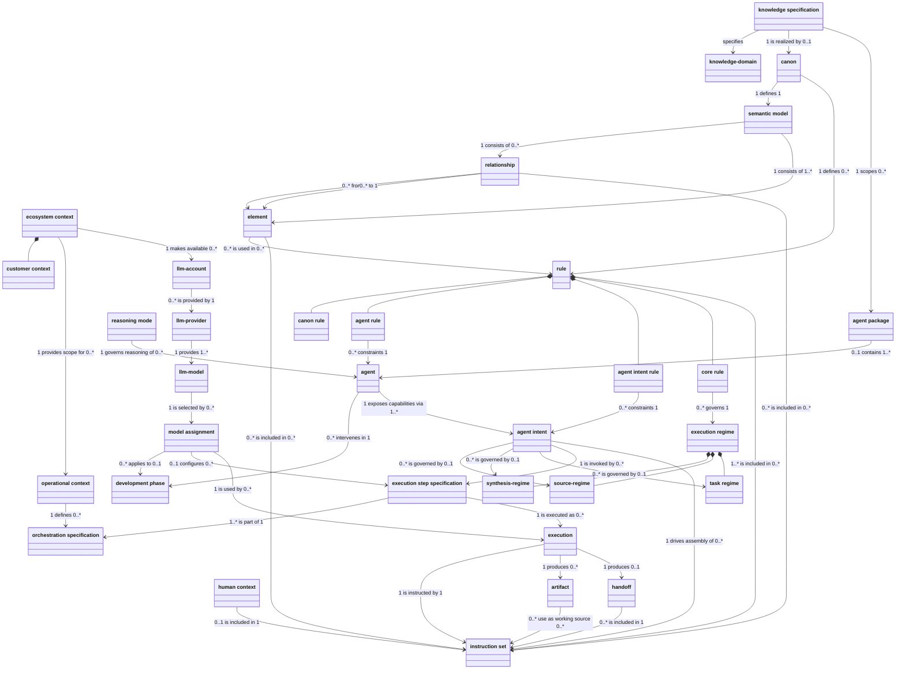

# CDM - Agent Architecture

## Scope

Conceptual data model for the generic **Agent Architecture**: the structure required to specify, configure, coordinate and operationally use agents, independent of whether that architecture is used by a customer, by Entoli itself, or by both. Covers ecosystem/operational context, canon/semantic model, rules, agents and agent intents, execution regimes, model assignment, and execution/handoff/artifact concepts. Entity attributes are intentionally omitted — this is the conceptual (not logical) layer.

The development system by which agents, canons, canon rules, packages, and this architecture itself are authored, governed, evolved, or published is outside the scope of this conceptual model. That is a distinct, higher-level concern (Agent/Ecosystem Development); this CDM describes only what agents are and how they are configured, coordinated and operated. Entoli's own use of this architecture (e.g. to help develop canons or agent packages) is an instance of self-use, not a reason to model a development-system special case here — see the boundary statement below and the Notes on Entoli Context/Customer Context.

> Definieert de conceptuele structuur van agents en hun operationele inzet; het ontwikkelsysteem waarmee agents en deze architectuur worden ontworpen, beheerd en doorontwikkeld, valt buiten de scope.

The diagram below is a conceptual transcription. The [Object Reference](#object-reference) section is authoritative for object membership, naming, and documentation. It was originally generated directly from the ArchiMate model view `entoli-conceptual`; as of v3.0.0 it also reflects an accepted conceptual correction (removal of `Entoli Context`, re-scoping of `Operational Context` and `LLM Account` to `Ecosystem Context`) that has not yet been written back into that ArchiMate view — see the v3.0.0 Notes entry below.

## Diagram



## Notes

- This is a conceptual model: it fixes entities and relationships (with cardinalities), not attributes, keys, or reference-entity detail. See `logical-data-models/` for the logical layer.
- Source: hand-drawn ER diagram supplied by the user (2026-09-05), transcribed as-is at v1.4.0; not yet reconciled against `ldm-canon.md`, `ldm-agent-services.md`, `ldm-coordination.md`, `ldm-execution.md`, or `ldm-operational-context.md`. Where this conceptual model and the logical models disagree, the discrepancy must be reconciled explicitly; the logical models must not silently redefine the accepted conceptual meaning.
- **v2.0.0 (2026-09-05)**: architectural repair pass following review of v1.4.0. Corrected relationships, cardinalities and affected Business Object documentation so the Mermaid CDM and the Object Reference express one coherent conceptual architecture — see the completion report delivered alongside this repair for the full list of changes, cardinality validation, and remaining open items. No Business Object was added or removed; object membership between Mermaid and Object Reference is unchanged by this pass.
- **v2.1.0 (2026-09-05)**: semantic correction pass. Tightened Ecosystem Context and Operational Context, restored Semantic Model as a first-class conceptual graph, clarified Agent Package knowledge scoping, Instruction Set composition, Model Assignment preconfiguration versus actual use, LLM Account routing boundaries, and Execution semantics. No Business Object or Mermaid relationship was added or removed.
- **v3.0.0 (2026-09-05)**: re-scoped this document from the Agent Development canon to the generic **Agent Architecture** — what agents are and how they are configured, coordinated and operated, independent of whether the architecture is used by a customer, by Entoli itself, or by both. Architectural correction: `Operational Context` and `LLM Account` were re-scoped from `Customer Context` to `Ecosystem Context` (`ecosystem context --> operational context : 1 provides scope for 0..*`; `ecosystem context --> llm-account : 1 makes available 0..*`), since both are facilities of any bounded ecosystem context, not exclusively of the customer-facing case. `Entoli Context` was removed — it carried no independent conceptual meaning beyond "not Customer Context" once ownership no longer depended on the Entoli-side/customer-side distinction; Entoli's own use of the architecture is now represented only as an example application of the generic `Ecosystem Context`, not a structural special case. `Customer Context` was evaluated against the same test and retained: unlike Entoli Context, it is not a singleton label but identifies which of potentially many customer organisations a given `Ecosystem Context` belongs to (an identity, not a mere axis position) — see the `customer context` and `ecosystem context` entries below and the completion report delivered alongside this change for the full reasoning. This is a genuine object-membership change: object count drops from 35 to 34. **Provenance note**: this correction is accepted at the conceptual layer but has not yet been written back into the ArchiMate view `entoli-conceptual`, which still contains `Entoli Context` and the prior Customer-Context-owned relationships; the Object Reference below is therefore, as of v3.0.0, no longer a 1:1 transcription of that ArchiMate view until a future write-back reconciles them.
- The Mermaid diagram above and the Object Reference below were checked against each other as of v3.0.0: both enumerate the same 34 objects with the same names. No membership discrepancy was found.
- **v3.1.0 (2026-09-05)**: template-conformance pass, on explicit user request. Every object in the Object Reference below is now documented in the DEFINITIE/DOEL/LEIDENDE VRAAG/RELATIES/BEPERKINGEN/INVARIANTEN structure of `templates/concept-definition.template.md`. Nine objects previously did not conform: `agent intent rule`, `core rule`, `development phase`, `element`, `knowledge-domain`, `knowledge specification` and `relationship` had no template-structured documentation at all (short, mostly English "Definition" paragraphs) and were authored in full; `artifact` and `llm-model` had every section except INVARIANTEN, which was added; `rule` had every section except LEIDENDE VRAAG, which was added. No Business Object, Mermaid relationship, or cardinality was added, removed, or changed by this pass — it is documentation-only. For `knowledge specification` and `knowledge-domain`, whose authoritative canonical meaning lives in `canons/.semantic-core/elements/semantic-core-concepts.md` (see each entry's own Canonical ownership note), this pass adds template-conformant documentation here without changing that ownership.

## Object Reference

All 34 objects belonging to the Agent Architecture conceptual data model, all modelled in ArchiMate as `archimate:BusinessObject`. All 34 were originally modelled in the ArchiMate view `entoli-conceptual` (`b.business-architecture/entoli-conceptual`, diagram id `id-e370b29df1904e7aa3dff365806a402d`) in `entoli-architecture-model.archimate`, which contained 35 objects in total; the 35th, `entoli context`, was removed from this conceptual model at v3.0.0 (see Notes) and no longer appears here, pending a future write-back that reconciles the ArchiMate view itself. Ordered alphabetically by object name (case-insensitive).

Two kinds of documentation appear below. **Preserved** documentation was already present on the ArchiMate element and is reproduced verbatim from its `documentation` field — not summarized, rewritten, translated, or reworded, including where it is in Dutch (one exception, explicitly authorized by a later review: `model assignment`'s pre-existing LLM Account wording was corrected — see that object's own entry and the review report referenced below). **Authored** documentation (FASE 2, see `plan-archi-op-orde.md`) was written and subsequently critically reviewed in this pass for objects that had no ArchiMate documentation (`NOG TOEVOEGEN`); it is Dutch prose synthesized from `templates/concept-definition.template.md`, the current Mermaid CDM above, and `canons/agent-development-canon/elements/agent-development-concepts.md` / `canons/.semantic-core/elements/semantic-core-concepts.md`. Each authored definition states accepted conceptual meaning; open questions, suspected model defects, and provenance detail are kept out of the definitions themselves and tracked separately in the FASE 2 review report. Authored documentation is a candidate for write-back into the ArchiMate model's `documentation` field (FASE 4 onward) but has not yet been written back — the `.archimate` file itself is unmodified.

Documentation blocks that follow the DEFINITIE/DOEL/LEIDENDE VRAAG/RELATIES/BEPERKINGEN/INVARIANTEN structure (see [`concept-definition.template.md`](../../../../../templates/concept-definition.template.md)) have their line breaks normalised to that template's convention — a hard return after each section heading — for `execution step specification`, `handoff`, and `orchestration specification`, whose source text had the heading and its content on the same line. This is a whitespace-only normalisation: no word was added, removed, or reordered.

### agent (FASE 2, authored)

- ArchiMate element type: `archimate:BusinessObject`
- ArchiMate element id: `id-a21ac844b75946b0b94ab3450c81ed27`

Documentation:

```text
DEFINITIE
Een Agent (canoniek: Entoli-agent) is een expliciet gedefinieerde, autonome softwareentiteit binnen het Entoli-ecosysteem die op basis van een formeel agent-charter en agent-contract taken uitvoert, Entoli-artifacts produceert of informatie levert, en die altijd opereert binnen een afgebakende agent-boundary en volgens het toepasselijke governance-regime.

DOEL
Verantwoordelijkheid, bevoegdheid en gedrag expliciet en herleidbaar toekennen aan één autonome uitvoerder binnen het ecosysteem, zodat capabilities nooit impliciet of ad hoc worden uitgevoerd, maar altijd via een formeel gelegitimeerde Agent.

LEIDENDE VRAAG
Welke autonome, formeel gelegitimeerde uitvoerder is verantwoordelijk voor deze capability?

RELATIES
Een Agent behoort tot ten hoogste één Agent Package. Een Agent wordt geclassificeerd door precies één Reasoning Mode, die bepaalt of de Agent Intents van de Agent aan het content-governance-model (Source-regime, Synthesis-regime, Task Regime) zijn onderworpen. Een Agent intervenieert in precies één Development Phase. Een Agent stelt zijn capabilities beschikbaar via één of meer Agent Intents. Een Agent wordt niet rechtstreeks door een Knowledge Specification gescoped: die scoping werkt via het Agent Package waartoe de Agent behoort (zie Agent Package, Knowledge Specification).

BEPERKINGEN
Een Agent is geen Agent Intent: een Agent Intent is één aanroepbare capability binnen de grenzen van de Agent, niet de Agent zelf. Een Agent is geen technische implementatie, tooling of prompt-structuur: de agent-boundary is onafhankelijk van de wijze waarop de Agent technisch wordt gerealiseerd.

INVARIANTEN
Iedere Agent heeft precies één Reasoning Mode en precies één Development Phase. Alle Agent Intents van een Agent opereren binnen de ene, gedeelde agent-boundary van die Agent.
```

### agent intent (FASE 2, authored)

- ArchiMate element type: `archimate:BusinessObject`
- ArchiMate element id: `id-fc519c97c3c04fb3b43a50b72f0aef38`

Documentation:

```text
DEFINITIE
Een Agent Intent is een expliciet aanroepbare capability van een Agent: één samenhangende eenheid van werk die de Agent binnen zijn agent-boundary aanbiedt, vastgelegd in het agent-contract van die Agent.

DOEL
Het werk van een Agent opdelen in expliciet aanroepbare, afzonderlijk classificeerbare eenheden, zodat elke eenheid werk zijn eigen bronregime, synthese-toestemming en taakvorm kan dragen zonder de grenzen van de Agent zelf te wijzigen.

LEIDENDE VRAAG
Welke specifieke, aanroepbare capability van deze Agent wordt hier uitgevoerd?

RELATIES
Een Agent stelt zijn capabilities beschikbaar via één of meer Agent Intents; iedere Agent Intent behoort tot precies één Agent. Een Agent Intent wordt aangeroepen door nul of meer Execution Step Specifications; iedere Execution Step Specification roept precies één Agent Intent aan. Alleen wanneer de Reasoning Mode van de Agent Cognitive is, declareert een Agent Intent precies één positie op elk van de drie specialisaties van Execution Regime (Source Regime, Synthesis Regime, Task Regime); onder Deterministic declareert de Agent Intent geen van de drie (zie Reasoning Mode, Execution Regime). Een Agent Intent drijft de samenstelling van nul of meer Instruction Sets aan. Een Agent Intent Rule beperkt precies één Agent Intent.

BEPERKINGEN
Een Agent Intent is geen Agent: het is één capability binnen de grenzen van een Agent, niet de Agent zelf, en overschrijdt nooit de agent-boundary van zijn Agent. Een Agent Intent is geen Execution Step Specification: de Execution Step Specification specificeert wanneer en hoe een Agent Intent wordt aangeroepen, maar is niet de capability zelf. Een Agent Intent is geen Execution: de Execution is de concrete, tijdgebonden uitvoering; de Agent Intent is de aanroepbare capability die daarbij wordt aangesproken. Een Agent Intent declareert nooit zijn eigen Reasoning Mode: het erft die van zijn Agent (zie Reasoning Mode).

INVARIANTEN
Iedere Agent Intent behoort tot precies één Agent en opereert altijd binnen de agent-boundary van die Agent. Iedere Agent Intent van een Agent met Reasoning Mode Cognitive wordt gegoverneerd door precies één Execution Regime van elke specialisatie; iedere Agent Intent van een Agent met Reasoning Mode Deterministic wordt door geen enkele specialisatie gegoverneerd.
```

### agent intent rule (authored 2026-09-05)

- ArchiMate element type: `archimate:BusinessObject`
- ArchiMate element id: `id-7c826e60007f41aeaaddbcb4fc50958d`

Documentation:

```text
DEFINITIE
Een Agent Intent Rule is een normatieve regel die specifiek aan één Agent Intent is gebonden en uitsluitend binnen de eigen werking van die Agent Intent van toepassing is — niet gedeeld met enige andere Agent Intent van dezelfde Agent.

DOEL
Operationeel gedrag vastleggen dat specifiek is voor één afzonderlijke capability van een Agent, zodat verschillen tussen Agent Intents van dezelfde Agent expliciet en herleidbaar kunnen worden vastgelegd zonder de gedeelde, agentbrede normen van Agent Rule te hoeven wijzigen.

LEIDENDE VRAAG
Welke norm geldt uitsluitend voor deze ene Agent Intent, en niet voor de andere Agent Intents van dezelfde Agent?

RELATIES
Een Agent Intent Rule beperkt precies één Agent Intent; een Agent Intent kan door nul of meer Agent Intent Rules worden beperkt. Een Agent Intent Rule is één van de vier specialisaties van Rule, naast Agent Rule, Canon Rule en Core Rule.

BEPERKINGEN
Een Agent Intent Rule is geen Agent Rule: die geldt voor alle Agent Intents van een Agent gezamenlijk, niet voor één specifieke Agent Intent. Een Agent Intent Rule is geen Canon Rule: zij is niet canoniek afgeleid, niet ecosysteembreed, en configureerbaar binnen de grenzen die het agent-contract stelt.

INVARIANTEN
Een Agent Intent Rule is uitsluitend van toepassing binnen de eigen werking van de ene Agent Intent waaraan zij is gekoppeld, en wordt nooit gedeeld met een andere Agent Intent van dezelfde Agent.
```

### agent package (FASE 2, authored)

- ArchiMate element type: `archimate:BusinessObject`
- ArchiMate element id: `id-a5736e6c7c874d5589622b6158eae9ee`

Documentation:

```text
DEFINITIE
Een Agent Package is een beheerde bundel van één of meer Agents die intrinsiek is gescoped door precies één Knowledge Specification. Het package verbindt daarmee een verzameling professionele functies aan een vaste kenniscontext waarin zij bedoeld zijn te opereren.

DOEL
Agents als samenhangende, kennisgebonden bundel beheren en overdraagbaar maken, zodat expliciet is welke Knowledge Specification de semantische scope van het package bepaalt.

LEIDENDE VRAAG
Welke Agents vormen samen deze bundel en door welke Knowledge Specification wordt hun package gescoped?

RELATIES
Een Agent Package bevat één of meer Agents; een Agent behoort tot ten hoogste één Agent Package. Iedere Agent Package wordt door precies één Knowledge Specification gescoped; een Knowledge Specification kan nul of meer Agent Packages scopen.

BEPERKINGEN
Een Agent Package is geen Agent: het bundelt Agents maar voert zelf geen Agent Intent uit. Een Agent Package is geen Knowledge Specification: de Knowledge Specification bepaalt de kennisinhoudelijke scope van het package. Een Agent Package is evenmin een Ecosystem Context of Customer Context. De positie of het beheer van een package in het ecosysteem mag niet worden verward met de Knowledge Specification die het package inhoudelijk scopet.

INVARIANTEN
Iedere Agent Package heeft precies één Knowledge Specification als vaste conceptuele scope. Een Agent Package wisselt niet van Knowledge Specification; een andere kennisinhoudelijke scope betekent conceptueel een ander Agent Package.
```

### agent rule (FASE 2, authored)

- ArchiMate element type: `archimate:BusinessObject`
- ArchiMate element id: `id-9dd7d63f3bda44a6919074aa6bd45c04`

Documentation:

```text
DEFINITIE
Een Agent Rule is een normatieve regel, vastgelegd in een agent-contract, die van toepassing is op elke Agent Intent van een gegeven Agent — gedeelde normatieve structuur op agentniveau, niet specifiek voor één afzonderlijke Agent Intent.

DOEL
Een gemeenschappelijke, agentbrede norm vastleggen die alle Agent Intents van dezelfde Agent bindt, zodat verschillende capabilities van één Agent zich consistent gedragen zonder dat elke Agent Intent die norm afzonderlijk hoeft te herhalen.

LEIDENDE VRAAG
Welke norm geldt voor elke Agent Intent van deze ene Agent, ongeacht welke specifieke capability wordt aangeroepen?

RELATIES
Een Agent Rule beperkt precies één Agent. Een Agent Rule is één van de vier specialisaties van Rule, naast Agent Intent Rule, Canon Rule en Core Rule.

BEPERKINGEN
Een Agent Rule is geen Agent Intent Rule: die geldt voor precies één Agent Intent, niet voor alle intents van een Agent gezamenlijk. Een Agent Rule is geen Canon Rule: zij is niet canoniek afgeleid, niet ecosysteembreed, en configureerbaar binnen de grenzen van het agent-contract.

INVARIANTEN
Een Agent Rule is uniform van toepassing op alle Agent Intents van de Agent waaraan zij is gekoppeld.
```

### artifact (FASE 2, authored)

- ArchiMate element type: `archimate:BusinessObject`
- ArchiMate element id: `id-4e0f720907c34ad186ec8a6958817d41`

Documentation:

```text
DEFINITIE
Een Artifact (canoniek: Entoli artifact) is een duurzame, expliciete en overdraagbare vastlegging van een resultaat of beslissing, die waarde vertegenwoordigt en als input kan dienen voor vervolgwerk.

DOEL
Het resultaat van uitvoering herleidbaar, overdraagbaar en duurzaam vastleggen, zodat het onafhankelijk van de uitvoering die het heeft voortgebracht, bruikbaar blijft voor vervolgwerk.

LEIDENDE VRAAG
Welk duurzaam, overdraagbaar resultaat is hier vastgelegd?

RELATIES
Een Execution produceert nul of meer Artifacts; iedere Artifact komt voort uit precies één Execution. Eén of meer Artifacts worden door nul of meer Instruction Sets als working source gebruikt.

BEPERKINGEN
Een Artifact is geen Handoff: een Handoff draagt interpretatie en context over tussen Executions, maar is zelf geen duurzaam werkproduct. Een Artifact is geen Instruction Set: het is het resultaat van uitvoering, niet de samengestelde instructiebasis waarmee wordt uitgevoerd.

INVARIANTEN
Iedere Artifact komt voort uit precies één Execution. Een Artifact blijft, onafhankelijk van de Execution die het heeft voortgebracht, bruikbaar als working source voor nul of meer Instruction Sets.
```

### canon (FASE 2, authored)

- ArchiMate element type: `archimate:BusinessObject`
- ArchiMate element id: `id-6d66d6cdd2534270b0f3732e4ecec8cc`

Documentation:

```text
DEFINITIE
Canon is de autoritatieve semantische grondslag voor een domein. De Canon definieert de canonieke betekenis, het Semantic Model en de normatieve Rules die nodig zijn voor eenduidige interpretatie, herleidbaarheid en reproduceerbaar gebruik van die betekenis.

DOEL
Eén gezaghebbende bron van betekenis en normering vastleggen voor een domein, zodat interpretatie niet afhankelijk is van impliciete kennis, conventie of de werking van een individuele Agent.

LEIDENDE VRAAG
Wat is voor dit domein de gezaghebbende, versiebeheerde grondslag van betekenis en normering?

RELATIES
Een Canon definieert precies één Semantic Model. Een Canon definieert nul of meer Rules, waaronder Canon Rules. Een Knowledge Specification wordt door nul of maximaal één Canon gerealiseerd.

BEPERKINGEN
Canon is geen Semantic Model: de Canon is de autoritatieve grondslag; het Semantic Model is de volledige semantische graaf die door die Canon wordt gedefinieerd. Canon is geen Canon Rule: een Canon Rule is één normatieve regel die haar gezag aan de Canon ontleent. Canon is geen execution-specifiek Artifact en verandert niet per Execution.

INVARIANTEN
Iedere Canon definieert precies één Semantic Model. Canonieke betekenis en normering zijn tijdens uitvoering niet muteerbaar door een Agent of Execution. De technische representatie of compilatie van de Canon behoort niet tot het conceptuele begrip Canon.
```

### canon rule (FASE 2, authored)

- ArchiMate element type: `archimate:BusinessObject`
- ArchiMate element id: `id-03e98ce0196345b599d814c30d4a986a`

Documentation:

```text
DEFINITIE
Een Canon Rule is een regel die haar normatieve gezag ontleent aan de Canon, en de systeemintegriteit en architecturale invarianten bewaakt binnen het geldigheidsbereik dat voor die regel is vastgelegd.

DOEL
Een canoniek gezaghebbende, niet-onderhandelbare ondergrens van gedrag vastleggen die geen enkele Agent Rule of Agent Intent Rule binnen haar geldigheidsbereik mag overschrijven — zonder daarmee te veronderstellen dat elke Canon Rule op elke Agent en Agent Intent van toepassing is.

LEIDENDE VRAAG
Welke regel ontleent haar gezag aan de Canon, en binnen welk geldigheidsbereik geldt zij?

RELATIES
Een Canon definieert nul of meer Canon Rules. Een Canon Rule is één van de vier specialisaties van Rule, naast Agent Rule, Agent Intent Rule en Core Rule.

BEPERKINGEN
Een Canon Rule is geen Agent Rule: een Agent Rule is agent-gebonden en configureerbaar binnen de grenzen van het agent-contract; een Canon Rule ontleent haar gezag aan de Canon en is niet door de gebruiker bewerkbaar. Een Canon Rule is geen Agent Intent Rule: die is smaller in reikwijdte (één intent) en eveneens configureerbaar. Canonieke autoriteit is niet hetzelfde als universele toepasselijkheid: dat een Canon Rule canoniek gezaghebbend is, betekent niet automatisch dat zij op elke Agent en elke Agent Intent van toepassing is — het geldigheidsbereik van een Canon Rule wordt expliciet vastgelegd, niet verondersteld.

INVARIANTEN
Geen Agent Rule of Agent Intent Rule mag een Canon Rule tegenspreken binnen het geldigheidsbereik van die Canon Rule. Een Canon Rule is uniform van toepassing op alle Agents en Agent Intents binnen haar vastgelegde geldigheidsbereik, niet noodzakelijk daarbuiten.
```

### core rule (authored 2026-09-05)

- ArchiMate element type: `archimate:BusinessObject`
- ArchiMate element id: `id-697686712c9f40faa2f23c8994eaef05`

Documentation:

```text
DEFINITIE
Een Core Rule is een regel die afkomstig is uit de canon, niet door de gebruiker wijzigbaar is, en tot doel heeft de structurele en gedragsmatige integriteit van het systeem te waarborgen. Een Core Rule governt precies één Execution Regime.

DOEL
Een canoniek gezaghebbende, voor de gebruiker onveranderlijke waarborg vastleggen die de integriteit van Execution Regime beschermt, onafhankelijk van en niet noodzakelijk zichtbaar binnen enig Instruction Set.

LEIDENDE VRAAG
Welke canoniek gezaghebbende waarborg beschermt de integriteit van dit Execution Regime?

RELATIES
Een Core Rule governt precies één Execution Regime; een Execution Regime kan door nul of meer Core Rules worden gegovernd. Een Core Rule is één van de vier specialisaties van Rule, naast Agent Rule, Agent Intent Rule en Canon Rule.

BEPERKINGEN
Een Core Rule is geen Canon Rule: beide zijn canoniek afgeleid en onveranderlijk voor gebruikers, maar een Canon Rule normeert agent- en agent-intentgedrag en is zichtbaar als inhoud binnen een Instruction Set, terwijl een Core Rule specifiek de integriteit van Execution Regime bewaakt en niet noodzakelijk instruction-set-zichtbaar is — het gezag is gedeeld, de functie en zichtbaarheid niet. Een Core Rule is geen Agent Rule of Agent Intent Rule: geen van beide is canoniek afgeleid of onveranderlijk.

INVARIANTEN
Een Core Rule is voor de gebruiker te allen tijde onveranderlijk. Iedere Core Rule is herleidbaar tot precies één Execution Regime waarvan zij de integriteit waarborgt.
```

**Review note (FASE 3, 2026-09-05, appended — preserved text above left verbatim)**: Core Rule and Canon Rule are both canon-derived and both immutable for users, which is why they are easy to conflate — but they are not semantically interchangeable. A Canon Rule derives normative authority from the Canon and is surfaced through ordinary Rule inclusion in Instruction Sets (see Rule, Instruction Set); its applicability is scoped explicitly per Canon Rule and is never assumed to be universal (see Canon Rule, this pass's correction). A Core Rule is Entoli-core normative structure that specifically governs the integrity of Execution Regimes (`core rule --> execution regime : 0..* governs 1`); it is described as obfuscated or hidden, i.e. it does not necessarily surface as content within an Instruction Set the way a Canon Rule does. The distinction is: **authority** (both canon-derived, both immutable) versus **function and surfacing** (Canon Rule normes agent/agent-intent behaviour and is instruction-set-visible; Core Rule guards Execution Regime integrity and may not be instruction-set-visible). This is drawn from the two objects' existing documentation and their existing Mermaid relationships; it is not a new distinction invented for this repair. A write-back of this clarification into Core Rule's own ArchiMate `documentation` field is deferred to FASE 4 onward, consistent with how this file's preserved/authored provenance convention is applied elsewhere.

### customer context (FASE 2, authored)

- ArchiMate element type: `archimate:BusinessObject`
- ArchiMate element id: `id-fe7e9177ff87428e83ada3d9c79a468c`

Documentation:

```text
DEFINITIE
Customer Context is een optionele specialisatie van Ecosystem Context die identificeert tot welke specifieke klantorganisatie een gegeven Ecosystem Context behoort. Waar Ecosystem Context de generieke, klant-onafhankelijke afbakening is van één begrensd gebruik van de Agent Architecture, voegt Customer Context daaraan toe wélke concrete organisatie dat specifieke gebruik toebehoort, wanneer dat gebruik klantgebonden is.

DOEL
Expliciet vastleggen tot welke specifieke klantorganisatie een Ecosystem Context behoort, zodat verschillende klanten van elkaar kunnen worden onderscheiden zonder dat de Agent Architecture zelf een klant-specifiek mechanisme nodig heeft.

LEIDENDE VRAAG
Tot welke specifieke klantorganisatie behoort deze Ecosystem Context, indien van toepassing?

RELATIES
Een Ecosystem Context kan ten hoogste één Customer Context hebben; een Customer Context identificeert precies één Ecosystem Context. Customer Context is niet langer één van twee uitputtende posities op een as: Ecosystem Context kent geen vaste, uitputtende opsomming van specialisaties (zie Ecosystem Context). Customer Context scopet Operational Context of LLM Account niet rechtstreeks: beide worden rechtstreeks door Ecosystem Context gescoped, ongeacht of die Ecosystem Context een Customer Context heeft (zie Ecosystem Context, Operational Context, LLM Account).

BEPERKINGEN
Customer Context is geen Operational Context: het identificeert een klantorganisatie, het is geen operationele omgeving zelf. Customer Context is geen Ecosystem Context: het is een optionele, identificerende specialisatie ervan, niet de generieke afbakening zelf. Customer Context bezit of beheert geen Operational Contexts of LLM Accounts.
```

**Review note (FASE 3, 2026-09-05, appended as part of the v3.0.0 Agent Architecture correction)**: Customer Context was evaluated against the same conceptual test applied to Entoli Context — "does this represent an independently meaningful concept, or is it merely a concrete application/instance of Ecosystem Context?" — and retained, unlike Entoli Context, for a specific reason: Entoli Context was a singleton label with no distinguishing content of its own (there is only one Entoli), whereas Customer Context identifies *which* of potentially many customer organisations a given Ecosystem Context belongs to — a genuine identity, not a mere axis position. This is consistent with the canonical `Client` Domain Element in `canons/agent-development-canon/elements/agent-development-concepts.md` ("the organizational boundary that owns one or more Operational Contexts"). **Open question, not resolved here**: whether `Customer Context` should be renamed to align with that canonical `Client` terminology is left unresolved; this pass preserves the existing name rather than inventing a rename. See the completion report for this correction.

### development phase (authored 2026-09-05)

- ArchiMate element type: `archimate:BusinessObject`
- ArchiMate element id: `id-2e25dc5832d04ffb907846209ef549b7`

Documentation:

```text
DEFINITIE
Development Phase is de classificatie-as die aangeeft in welke fase van de totstandkoming van werk een Agent intervenieert, gepositioneerd in de keten van eerste verkenning tot operationalisering.

DOEL
Expliciet maken waar in het ontwikkelproces een Agent opereert, onafhankelijk van het soort handeling dat de Agent uitvoert, zodat ordening, bestuurbaarheid en herleidbaarheid van Agents binnen het ecosysteem mogelijk worden.

LEIDENDE VRAAG
Waar in de totstandkoming van het werk vindt de interventie van deze Agent plaats?

WAARDEN
Exploration (Verkenning) — onderzoeken van intentie, probleemstelling of richting.
Ordering (Ordening) — structureren van de intentie en expliciet maken van samenhang.
Specification (Specificatie) — betekenis bindend vastleggen binnen de workspace.
Realisation (Realisatie) — betekenis werkend maken in systemen of processen.
Testing (Toetsing) — het gerealiseerde toetsen aan een vastgelegde norm.
Registering (Registratie) — vastleggen en verantwoordbaar maken van wat gerealiseerd is, inclusief traceerbaarheid, contextualisering en publicatie.
Operationalisation (Operationalisering) — de gerealiseerde structuur formeel in werking brengen.

RELATIES
Iedere Agent intervenieert in precies één Development Phase; een Development Phase geldt voor nul of meer Agents. Een Model Assignment kan van toepassing zijn op nul of één Development Phase; een Development Phase geldt voor nul of meer Model Assignments.

BEPERKINGEN
Development Phase classificeert de fase van interventie, niet het type activiteit, outputgedrag of een technische implementatiestap. Het is bovendien geen waardeschaal: een latere fase is niet belangrijker dan een eerdere fase. Development Phase is geen Reasoning Mode, Source Regime, Synthesis Regime of Task Regime: die bepalen wat een Agent Intent mag doen, terwijl Development Phase uitsluitend bepaalt waar de Agent zich in de keten van totstandkoming bevindt.

INVARIANTEN
Iedere Agent heeft precies één Development Phase. Geen enkele Development Phase-positie is per definitie belangrijker of gezaghebbender dan een andere.
```

### ecosystem context (FASE 2, authored)

- ArchiMate element type: `archimate:BusinessObject`
- ArchiMate element id: `id-a99dcf9067d84b2b9ddf4b7a8f40c647`

Documentation:

```text
DEFINITIE
Ecosystem Context is de generieke, afgebakende afbakening van één begrensd gebruik van de Agent Architecture: een omgeving waarbinnen Operational Contexts worden gescoped en LLM Accounts beschikbaar worden gemaakt, ongeacht of dat gebruik voor een klant is, voor Entoli zelf, of voor beide.

DOEL
Eén generiek concept bieden waarmee elk begrensd gebruik van de Agent Architecture kan worden afgebakend en waaraan Operational Context en LLM Account rechtstreeks kunnen worden gescoped, zonder dat de architectuur zelf een klant-specifiek of Entoli-specifiek mechanisme nodig heeft om te functioneren.

LEIDENDE VRAAG
Binnen welk begrensd gebruik van de Agent Architecture worden deze Operational Contexts gescoped en deze LLM Accounts beschikbaar gemaakt?

RELATIES
Een Ecosystem Context scopet nul of meer Operational Contexts; iedere Operational Context behoort tot precies één Ecosystem Context. Een Ecosystem Context maakt nul of meer LLM Accounts beschikbaar; ieder LLM Account wordt door precies één Ecosystem Context beschikbaar gemaakt. Een Ecosystem Context kan optioneel worden geïdentificeerd door precies één Customer Context, wanneer het gebruik klantgebonden is (zie Customer Context); dit is geen uitputtende specialisatie — Ecosystem Context veronderstelt geen vaste, gesloten verzameling van dit soort identificerende specialisaties. Reasoning Mode heeft geen relatie met Ecosystem Context; Reasoning Mode governt de reasoning van een Agent, niet van een Ecosystem Context.

BEPERKINGEN
Ecosystem Context is geen tenant, workspace, Agent Package of technische omgeving; het is een conceptuele afbakening, geen implementatiemechanisme. Ecosystem Context is niet exclusief klantgebonden of Entoli-gebonden: eenzelfde generieke afbakening geldt voor beide gevallen en voor elk ander begrensd gebruik. Het bestaan of gebruik van een Agent, Agent Package, Knowledge Domain of Knowledge Specification binnen een Ecosystem Context impliceert niet dat die Ecosystem Context daarvan eigenaar is. Knowledge Domain en Knowledge Specification zijn niet intrinsiek klant- of Entoli-gebonden.

INVARIANTEN
Iedere Operational Context behoort tot precies één Ecosystem Context. Ieder LLM Account wordt door precies één Ecosystem Context beschikbaar gemaakt. Een Ecosystem Context heeft ten hoogste één identificerende Customer Context.
```

**Review note (FASE 3, 2026-09-05, appended as part of the v3.0.0 Agent Architecture correction)**: prior versions of this document modelled Ecosystem Context as an abstract axis with exactly two exhaustive positions, Entoli Context and Customer Context, and scoped Operational Context/LLM Account to Customer Context specifically. Both were architectural errors: `Operational Context` and `LLM Account` are facilities of any bounded ecosystem context, not exclusively of the customer-facing case, and an ecosystem may use the Agent Architecture for customer-facing operation, for its own internal operation, or for both. This pass moves both relationships to Ecosystem Context directly and removes the closed two-value axis framing — see `entoli context` (removed, see below) and `customer context` (retained, reframed as an optional identifying specialisation, not one of two exhaustive positions).

### element (authored 2026-09-05)

- ArchiMate element type: `archimate:BusinessObject`
- ArchiMate element id: `id-a248b6e4d5a04c6c995cc9ecb4872d2e`

Documentation:

```text
DEFINITIE
Een Element is een expliciet gedefinieerde, benoemde betekeniseenheid binnen de Entoli semantische graaf. Elk Element wordt onderscheiden door zijn elementclassificatie en door de Relationships die het met andere Elements onderhoudt.

DOEL
Eén ondeelbare, herleidbare betekeniseenheid bieden waaruit een Semantic Model is opgebouwd, zodat canonieke betekenis niet impliciet of ongestructureerd blijft, maar altijd terug te voeren is op met naam benoemde, classificeerbare eenheden.

LEIDENDE VRAAG
Welke expliciet benoemde betekeniseenheid wordt hier gebruikt, en tot welk Semantic Model behoort zij?

RELATIES
Een Semantic Model bestaat uit één of meer Elements. Een Element vormt het from- of het to-eindpunt van nul of meer Relationships. Een Element wordt in nul of meer Rules gebruikt; een Rule kan nul of meer Elements gebruiken. Een Element kan worden opgenomen in nul of meer Instruction Sets.

BEPERKINGEN
Een Element is geen Relationship: het Element is de betekeniseenheid zelf, de Relationship is de expliciete, gerichte verbinding tussen twee Elements. Een Element is geen Semantic Model: het Semantic Model is de volledige graaf waarvan het Element één samenstellend onderdeel is.

INVARIANTEN
Ieder Element behoort tot precies één Semantic Model. Elke Relationship waarvan een Element het from- of to-eindpunt is, behoort tot hetzelfde Semantic Model als dat Element.
```

**Removed at v3.0.0 (2026-09-05)**: this Object Reference previously carried an `entoli context` entry here (ArchiMate element id `id-071282f95ced4cc8a12a5b85cdc8189d`), between `element` and `execution`. It has been removed from this conceptual model: after re-scoping `Operational Context` and `LLM Account` to `Ecosystem Context` directly (see `ecosystem context` above), Entoli Context carried no independent conceptual meaning beyond "not Customer Context" — it was a singleton label (there is only one Entoli) with no distinguishing relationships, attributes, or governance content of its own. Entoli is now represented only as an example application of the generic `Ecosystem Context` (see `operational context`, Entoli example), not as a separate architectural mechanism. The object was not replaced by another Entoli-specific Business Object; object count drops from 35 to 34 as a result. See the Notes section and the completion report for this correction.

### execution (FASE 2, authored)

- ArchiMate element type: `archimate:BusinessObject`
- ArchiMate element id: `id-2e8c595bfedb4d8ba8cedbdf2eb284f2`

Documentation:

```text
DEFINITIE
Een Execution is een tijdgebonden, concrete uitvoering van precies één Execution Step Specification. Tijdens de Execution wordt het gespecificeerde werk uitgevoerd op basis van precies één Instruction Set en met precies één daadwerkelijk gebruikte Model Assignment.

DOEL
Eén concrete occurrence van werk herleidbaar vastleggen, zodat de voorafgaande specificatie, de gebruikte instructiebasis, de toegepaste modelconfiguratie en de geproduceerde resultaten expliciet met elkaar verbonden zijn.

LEIDENDE VRAAG
Welke concrete uitvoering vond plaats, op basis van welke stap-specificatie, instructiebasis en modeltoewijzing?

RELATIES
Een Execution Step Specification kan nul of meer keren als Execution worden uitgevoerd; iedere Execution is de uitvoering van precies één Execution Step Specification. Iedere Execution wordt door precies één Instruction Set geïnstrueerd en gebruikt precies één Model Assignment. Een Execution produceert nul of meer Artifacts en nul of maximaal één Handoff.

BEPERKINGEN
Een Execution is geen Execution Step Specification: de specification beschrijft vooraf één uitvoeringsstap, terwijl de Execution de concrete occurrence daarvan is. Een Execution is geen Instruction Set en geen Model Assignment; deze instrueren respectievelijk configureren de concrete uitvoering. Een Execution heeft geen directe Operational Context-relatie wanneer die context eenduidig afleidbaar is via Execution Step Specification en Orchestration Specification.

INVARIANTEN
Iedere Execution is herleidbaar tot precies één Execution Step Specification, precies één Instruction Set, precies één daadwerkelijk gebruikte Model Assignment en via haar Orchestration Specification tot precies één Operational Context.
```

### execution regime (FASE 2, authored)

- ArchiMate element type: `archimate:BusinessObject`
- ArchiMate element id: `id-4cab30c96f5d468d98f0c6624bc3bd5d`

Documentation:

```text
DEFINITIE
Execution Regime is de verzamelnaam voor de drie classificatie-assen die gezamenlijk bepalen wat een Agent Intent mag doen: Source Regime (welke kennis toegankelijk is), Synthesis Regime (welke betekenistransformatie is toegestaan) en Task Regime (welke bewerkings- en uitvoervorm de stap heeft).

DOEL
Voor iedere Agent Intent waarvan de Reasoning Mode van de Agent Cognitive is, in één samenhangend geheel vastleggen welke combinatie van bron-, synthese- en taakregime van toepassing is, zodat deze drie onafhankelijk gedeclareerde assen gezamenlijk als één governance-mechanisme kunnen worden aangesproken en gecontroleerd.

LEIDENDE VRAAG
Welke combinatie van bron-, synthese- en taakregime governt deze Agent Intent, indien van toepassing?

SAMENSTELLING
Execution Regime bestaat uit precies drie specialisaties: Source Regime, Synthesis Regime en Task Regime.

RELATIES
Execution Regime bestaat uit (compositie) Source Regime, Synthesis Regime en Task Regime. Een Core Rule governt precies één Execution Regime. Reasoning Mode bepaalt of alle drie de specialisaties op een Agent Intent van toepassing zijn: onder Cognitive declareert een Agent Intent precies één positie op elk van Source Regime, Synthesis Regime en Task Regime; onder Deterministic declareert de Agent Intent geen van de drie (zie Reasoning Mode).

BEPERKINGEN
De drie specialisaties van Execution Regime zijn onderling orthogonaal: geen enkele specialisatie is afleidbaar uit, of impliceert, een waarde van de andere twee. Execution Regime is geen enkelvoudige schaal waarop de drie specialisaties inwisselbare posities zijn; elke specialisatie beantwoordt een eigen, onafhankelijke vraag. Execution Regime is niet universeel van toepassing op elke Agent Intent: toepasselijkheid is voorwaardelijk aan de Reasoning Mode van de Agent (Cognitive), niet een vast gegeven van elke Agent Intent.

INVARIANTEN
Iedere Agent Intent van een Agent met Reasoning Mode Cognitive wordt gegoverneerd door precies één Source Regime, precies één Synthesis Regime en precies één Task Regime. Iedere Agent Intent van een Agent met Reasoning Mode Deterministic wordt door geen van de drie gegoverneerd.
```

### execution step specification

- ArchiMate element type: `archimate:BusinessObject`
- ArchiMate element id: `id-95a0e0e6f3e1431da1195ba095f3435d`

Documentation:

```text
DEFINITIE
Een Execution Step Specification is de vooraf vastgelegde specificatie van één uitvoeringsstap binnen een Orchestration Specification. De stap bepaalt welke Agent Intent wordt aangeroepen en kan vooraf worden geconfigureerd met een Model Assignment.

DOEL
Het expliciet en herhaalbaar specificeren van één afzonderlijke uitvoeringsstap, zodat dezelfde stapconfiguratie nul, één of meerdere keren als concrete Execution kan worden uitgevoerd.

LEIDENDE VRAAG
Welke Agent Intent moet in deze stap worden uitgevoerd en welke vooraf bepaalde configuratie geldt daarvoor?

RELATIES
Iedere Execution Step Specification behoort tot precies één Orchestration Specification; een Orchestration Specification bevat één of meerdere Execution Step Specifications. Iedere Execution Step Specification roept precies één Agent Intent aan; een Agent Intent kan door nul of meerdere Execution Step Specifications worden aangeroepen. Een Execution Step Specification kan door maximaal één Model Assignment vooraf worden geconfigureerd; een Model Assignment kan nul of meerdere Execution Step Specifications configureren. Een Execution Step Specification kan nul of meerdere keren als Execution worden uitgevoerd; iedere Execution is de concrete uitvoering van precies één Execution Step Specification.

BEPERKINGEN
Een Execution Step Specification is geen Execution en bevat geen runtime-resultaat. Zij vertegenwoordigt één gespecificeerde stap en niet de volledige orchestratie. De interne werking van de aangeroepen Agent Intent behoort evenmin tot de Execution Step Specification.

INVARIANTEN
Iedere Execution Step Specification behoort tot precies één Orchestration Specification en roept precies één Agent Intent aan. Indien een Model Assignment vooraf is bepaald, is maximaal één Model Assignment aan de Execution Step Specification gekoppeld. Een concrete Execution is altijd herleidbaar tot precies één Execution Step Specification.
```

### handoff

- ArchiMate element type: `archimate:BusinessObject`
- ArchiMate element id: `id-4215cbb5ea2e4b41bf3966ed673a5740`

Documentation:

```text
DEFINITIE
Een Handoff is de expliciete overdracht van relevante interpretatie en context vanuit een afgeronde Execution naar vervolgwerk. Het legt vast wat een volgende uitvoering nodig heeft om het werk betekenisvol voort te zetten, zonder afhankelijk te zijn van impliciete kennis over de voorafgaande uitvoering.

DOEL
Het gecontroleerd en herleidbaar overdragen van context tussen opeenvolgende Executions, zodat vervolgwerk kan voortbouwen op eerder uitgevoerd werk zonder de volledige voorgaande uitvoering opnieuw te hoeven interpreteren.

LEIDENDE VRAAG
Welke interpretatie en context uit deze Execution moeten beschikbaar zijn om vervolgwerk correct te kunnen uitvoeren?

RELATIES
Een Execution produceert nul of maximaal één Handoff. Iedere Handoff wordt door precies één Execution geproduceerd. Een Handoff wordt opgenomen in precies één Instruction Set; een Instruction Set kan nul of meerdere Handoffs bevatten. Via het Instruction Set wordt de Handoff beschikbaar voor een volgende Execution.

BEPERKINGEN
Een Handoff is geen Artifact en vertegenwoordigt niet het duurzame werkproduct van een Execution. Het is evenmin een directe koppeling tussen twee Executions. Een Handoff draagt context over via het Instruction Set van vervolgwerk. De technische representatie, bijvoorbeeld als bestand, behoort niet tot het conceptuele begrip Handoff.

INVARIANTEN
Iedere Handoff is afkomstig uit precies één Execution en wordt opgenomen in precies één Instruction Set. Een Handoff kan uitsluitend context overdragen die voortkomt uit de Execution die de Handoff heeft geproduceerd. De ontvangende Execution is afleidbaar via het Instruction Set waarin de Handoff is opgenomen.
```

### human context

- ArchiMate element type: `archimate:BusinessObject`
- ArchiMate element id: `id-7970b9b7176341039f2e4af29e4d2d3a`

Documentation:

```text
DEFINITIE
Een Human Context is de samenhangende inhoudelijke context die door een mens wordt aangeleverd om een Agent Intent voor een concrete uitvoering te initiëren en inhoudelijk te specificeren.

DOEL
Het expliciet beschikbaar maken van informatie die niet uit de Canon, een Artifact of een eerdere Execution afkomstig is, maar door een mens wordt meegegeven als uitgangspunt voor het uit te voeren werk.

LEIDENDE VRAAG
Welke inhoudelijke context geeft de mens mee voor het uitvoeren van deze Agent Intent?

SAMENSTELLING
Een Human Context bestaat uit het geheel van waarden dat voor de betreffende Agent Intent door een mens wordt aangeleverd. Welke waarden nodig zijn, wordt bepaald door de betreffende intent. Bijvoorbeeld: een probleem, een veronderstelde oplossing, een doelgroep en aanvullende toelichting vormen gezamenlijk één Human Context. De afzonderlijke waarden zijn geen zelfstandige Human Contexts.

RELATIES
Een Human Context wordt opgenomen in een Instruction Set. Een Instruction Set kan nul of één Human Context bevatten. Een Human Context wordt opgenomen in precies één Instruction Set.

BEPERKINGEN
Een Human Context is geen Artifact, Handoff of Instruction Set. Het beschrijft evenmin het formulier, de invoervelden of de gebruikersinterface waarmee de informatie wordt verkregen. Deze behoren tot het functionele of technische ontwerp. Human Context representeert uitsluitend de betekenisvolle, door een mens aangeleverde context.

INVARIANTEN
Een Human Context heeft altijd een menselijke oorsprong. De inhoud moet betekenisvol zijn voor de Agent Intent waarvoor de Instruction Set wordt samengesteld. Het geheel van aangeleverde waarden vormt één Human Context; individuele parameters worden conceptueel niet als afzonderlijke bedrijfsobjecten gemodelleerd.
```

### instruction set

- ArchiMate element type: `archimate:BusinessObject`
- ArchiMate element id: `id-a4319ee116ab41dda18d476242ca88da`

Documentation:

```text
DEFINITIE
Een Instruction Set is de execution-specifieke samenstelling van normatieve, semantische en aangeleverde context die één concrete Execution instrueert.

DOEL
Voor één Execution expliciet en reproduceerbaar vastleggen welke regels, betekenis en context beschikbaar moeten zijn, zodat de uitvoering niet afhankelijk is van impliciete of niet-herleidbare informatie.

LEIDENDE VRAAG
Welke normatieve, semantische en aangeleverde context moet voor deze Execution beschikbaar zijn?

SAMENSTELLING
Een Instruction Set kan toepasselijke Rules, relevante Elements en Relationships uit een Semantic Model, maximaal één Human Context, nul of meer Handoffs en nul of meer Artifacts als working source bevatten. De precieze samenstelling volgt uit het uit te voeren werk. Het Instruction Set vormt geen zelfstandig Semantic Model, maar gebruikt waar nodig een execution-specifieke selectie uit bestaande canonieke betekenis.

RELATIES
Een Agent Intent drijft de samenstelling van nul of meer Instruction Sets aan. Een Instruction Set instrueert precies één Execution en iedere Execution wordt door precies één Instruction Set geïnstrueerd. Een Human Context wordt in precies één Instruction Set opgenomen en een Instruction Set bevat maximaal één Human Context. Een Handoff wordt in precies één Instruction Set opgenomen en een Instruction Set kan nul of meer Handoffs bevatten. Artifacts kunnen als working source in nul of meer Instruction Sets worden gebruikt.

BEPERKINGEN
Een Instruction Set introduceert geen nieuwe canonieke betekenis. Opgenomen Elements en Relationships blijven herleidbaar tot hun Semantic Model en opgenomen Rules behouden hun normatieve betekenis. Een Handoff draagt context uit een eerdere Execution over; een Artifact is een duurzaam werkproduct dat als working source kan worden hergebruikt. Deze functies zijn niet onderling uitwisselbaar.

INVARIANTEN
Iedere Execution wordt geïnstrueerd door precies één Instruction Set. Alle opgenomen semantische Elements en Relationships zijn herleidbaar tot hun Semantic Model. Iedere opgenomen Rule is voor de betreffende Execution van toepassing. Iedere opgenomen Handoff is afkomstig uit precies één eerdere Execution.
```

### knowledge specification (authored 2026-09-05)

- ArchiMate element type: `archimate:BusinessObject`
- ArchiMate element id: `id-1d62c68e5893433f81d1472f83cfad2d`

Documentation:

```text
DEFINITIE
Een Knowledge Specification is de expliciete specificatie van de kennis uit een Knowledge Domain die voor een bepaald doel gerepresenteerd en gegoverneerd moet worden. Zij bepaalt welke kennis uit het domein expliciet gemaakt moet worden en met welke bedoeling, zonder zelf die kennis te zijn of noodzakelijk al de concrete Canon.

DOEL
Vooraf en onafhankelijk van een concrete Canon vastleggen welke kennis uit een Knowledge Domain gerepresenteerd en gegoverneerd moet worden, zodat kennisgovernance kan bestaan voordat een Canon of een daarvan afhankelijke structuur, zoals een Agent Package, tot stand is gekomen.

LEIDENDE VRAAG
Welke kennis uit dit Knowledge Domain moet expliciet worden gerepresenteerd en gegoverneerd, en met welk doel?

RELATIES
Een Knowledge Specification specificeert precies één Knowledge Domain. Een Knowledge Specification wordt door nul of maximaal één Canon gerealiseerd. Een Knowledge Specification scopet nul of meer Agent Packages; iedere Agent Package wordt door precies één Knowledge Specification gescoped.

BEPERKINGEN
Een Knowledge Specification is geen Knowledge Domain: het Domein is waar de kennis over gaat, de Specification is wat daarover expliciet gerepresenteerd en gegoverneerd moet worden. Een Knowledge Specification is geen Canon: de Canon is de daadwerkelijke, autoritatieve realisatie van wat de Specification vereist; de Specification stelt alleen vast wat expliciet gemaakt moet worden, niet de canonieke antwoorden zelf. Een Knowledge Specification is geen eigendom van een specifieke Customer Context of Ecosystem Context enkel omdat zij daar wordt gebruikt.

INVARIANTEN
Iedere Knowledge Specification specificeert precies één Knowledge Domain. Een Knowledge Specification kan bestaan voordat enige Canon haar realiseert of enige Agent Package die zij scopet bestaat.

VOORBEELD
Knowledge Domain "Data Modelling" wordt gespecificeerd door Knowledge Specification "Entoli Logical Data Modelling", die onder andere verlangt dat expliciet wordt gemaakt wat een Entity, een Reference Entity, een Relationship en Cardinality zijn, hoe entities worden geïdentificeerd, hoe relaties worden gerepresenteerd, en welke modelleerregels normatief zijn. De Canon realiseert vervolgens die specificatie door de daadwerkelijke concepten, relaties en rules vast te leggen.
```

**Review note (FASE 3, 2026-09-05, appended — preserved text above left verbatim)**: this pass adds the explicit scoping relationship this entry did not previously state. A Knowledge Specification scopes zero or more Agent Packages (`knowledge specification --> agent package : 1 scopes 0..*`); an Agent Package is intrinsically scoped by exactly one Knowledge Specification. A Knowledge Specification can exist before any Agent Package that it scopes exists. Knowledge Specification does not scope Agent directly — that relationship runs via Agent Package (see Agent, Agent Package). Knowledge Specification and Knowledge Domain are not customer-owned merely because they are used within a Customer Context — see Ecosystem Context, Customer Context.

**Canonical ownership note (2026-09-05, appended)**: `Knowledge Specification`'s inclusion in this conceptual model does not by itself determine which Canon canonically owns its Elements-register definition — inclusion in a CDM and canonical ownership are distinct questions (see `canons/.enterprise-agent-development-canon/elements/agent-development-concepts.md` v1.4.0 completion report for the full reasoning). Canonical ownership has now been resolved, on explicit user decision: `Knowledge Specification` is a Semantic Core Meta Concept, defined in `canons/.semantic-core/elements/semantic-core-concepts.md`. It remains part of this CDM's diagram and Object Reference — the CDM is not redesigned by this decision — but this entry's authoritative documentation now lives in the Semantic Core, not here. One cardinality this CDM already states (`1 is realized by 0..1`, above) was found to conflict with `ldm-canon.md` (which states 0..*); this CDM's cardinality was explicitly confirmed as authoritative for that conflict — see the Semantic Core entry's own Provenance for the full resolution. **2026-09-05, template pass**: the Documentation block above was rewritten into the DEFINITIE/DOEL/LEIDENDE VRAAG/RELATIES/BEPERKINGEN/INVARIANTEN structure of `templates/concept-definition.template.md`, on explicit user request to bring every object in this Object Reference into template-conformant shape. This is a formatting/authoring pass, not a canonical-ownership change: `canons/.semantic-core/elements/semantic-core-concepts.md` remains the authoritative source for this concept's canonical meaning.

### knowledge-domain (authored 2026-09-05)

- ArchiMate element type: `archimate:BusinessObject`
- ArchiMate element id: `id-4e02ad03bf6d4963b101fdad1d0f7b7b`

Documentation:

```text
DEFINITIE
Een Knowledge Domain is een samenhangend vakgebied of afgebakend kennisdomein van concepten, relaties, praktijken en terminologie, onafhankelijk van enig specifiek framework, standaard of methodologie waarmee dat kennisdomein wordt beschreven.

DOEL
Vaststellen waar een kennisdomein inhoudelijk over gaat, los van welke canonieke interpretatie Entoli daaraan geeft, zodat kennisgovernance kan beginnen bij het domein zelf, voordat enige Knowledge Specification of Canon dat domein interpreteert.

LEIDENDE VRAAG
Over welk samenhangend kennisdomein gaat deze verzameling concepten, relaties en terminologie?

RELATIES
Een Knowledge Domain wordt door nul of meer Knowledge Specifications gespecificeerd; iedere Knowledge Specification specificeert precies één Knowledge Domain.

BEPERKINGEN
Een Knowledge Domain is geen Knowledge Specification: de Specification is een autoritatieve beschrijving van het domein, niet het domein zelf. Een Knowledge Domain is geen Canon: een Canon refereert nooit rechtstreeks aan een Knowledge Domain, maar uitsluitend via de keten Canon → Knowledge Specification → Knowledge Domain. Een Knowledge Domain is niet het eigendom van, of gedefinieerd door, één enkele Canon enkel omdat de inhoud van die Canon binnen het domein valt.

INVARIANTEN
Een Knowledge Domain kan groter zijn dan wat enige Knowledge Specification of Canon er uiteindelijk van vastlegt. Een Knowledge Domain vereist geen bestaande Knowledge Specification om als domein te worden erkend.

VOORBEELDEN
Agent Development kan een Knowledge Domain zijn. Daarbinnen vallen bijvoorbeeld onderwerpen als agent, intent, boundary, capability, orchestration, semantic scope en agent package; niet alles wat over Agent Development bekend is, hoeft onderdeel te zijn van de canon. Data Modelling is een tweede voorbeeld van een Knowledge Domain, waarin begrippen zoals Entity, Attribute, Relationship, Cardinality en Logical Data Model relevant zijn.
```

**Canonical ownership note (2026-09-05, appended)**: as with `knowledge specification` above, this object's inclusion in this conceptual model does not by itself determine canonical ownership. `Knowledge Domain` is a Semantic Core Meta Concept, defined in `canons/.semantic-core/elements/semantic-core-concepts.md`, on explicit user decision. It remains part of this CDM's diagram and Object Reference; only its authoritative documentation moved. **2026-09-05, template pass**: the Documentation block above was rewritten into the DEFINITIE/DOEL/LEIDENDE VRAAG/RELATIES/BEPERKINGEN/INVARIANTEN structure of `templates/concept-definition.template.md`, on explicit user request to bring every object in this Object Reference into template-conformant shape. This is a formatting/authoring pass, not a canonical-ownership change: the Semantic Core file remains authoritative for this concept's canonical meaning.

### llm-account (FASE 2, authored)

- ArchiMate element type: `archimate:BusinessObject`
- ArchiMate element id: `id-abdf3fc1a9504d1eb988ab196a0ecf67`

Documentation:

```text
DEFINITIE
Een LLM Account is de door een LLM Provider verstrekte toegang tot die Provider die binnen één Ecosystem Context beschikbaar wordt gemaakt voor het kunnen gebruiken van LLM Models van die Provider.

DOEL
Provider-toegang expliciet en onafhankelijk van modelkeuze modelleren, zodat beschikbaarheid van toegang binnen een Ecosystem Context niet wordt vastgelegd in een Agent, Agent Intent of Model Assignment.

LEIDENDE VRAAG
Welke toegang tot deze LLM Provider is binnen de Ecosystem Context beschikbaar?

RELATIES
Ieder LLM Account wordt door precies één LLM Provider verstrekt. Een LLM Provider kan nul of meer LLM Accounts verstrekken. Ieder LLM Account wordt door precies één Ecosystem Context beschikbaar gemaakt; een Ecosystem Context kan nul of meer LLM Accounts beschikbaar maken.

BEPERKINGEN
LLM Account is geen LLM Provider, LLM Model of Model Assignment. Een Model Assignment selecteert een LLM Model en niet rechtstreeks een LLM Account. Wanneer meerdere LLM Accounts voor dezelfde Provider binnen één Ecosystem Context beschikbaar zijn, bepaalt dit conceptuele model niet welk account technisch wordt gerouteerd; daarvoor is een afzonderlijke routeringsbeslissing nodig indien die semantiek relevant wordt.

INVARIANTEN
Een LLM Account behoort tot precies één LLM Provider en wordt binnen precies één Ecosystem Context beschikbaar gemaakt. Voor het daadwerkelijk gebruiken van een geselecteerd LLM Model moet passende toegang tot de Provider van dat model beschikbaar zijn.
```

### llm-model (FASE 2, authored)

- ArchiMate element type: `archimate:BusinessObject`
- ArchiMate element id: `id-47c7669317cf4b9aaec0c64751602214`

Documentation:

```text
DEFINITIE
Een LLM Model is het specifieke taalmodel, aangeboden door precies één LLM Provider, dat door een Model Assignment kan worden geselecteerd voor gebruik tijdens een Execution.

DOEL
Expliciet vastleggen welk specifiek model wordt ingezet, onafhankelijk van de Agent, de Agent Intent of de Model Assignment die het selecteert, zodat hetzelfde model voor verschillende soorten werk met verschillende configuraties kan worden ingezet.

LEIDENDE VRAAG
Welk specifiek taalmodel, van welke LLM Provider, wordt hier geselecteerd?

RELATIES
Een LLM Provider verstrekt één of meer LLM Models; ieder LLM Model wordt verstrekt door precies één LLM Provider. Een LLM Model wordt geselecteerd door nul of meer Model Assignments.

BEPERKINGEN
LLM Model is geen LLM Provider en geen LLM Account. LLM Model is geen Model Assignment: de Model Assignment selecteert en configureert het gebruik van een LLM Model voor een Execution, maar is niet het model zelf.

INVARIANTEN
Ieder LLM Model wordt verstrekt door precies één LLM Provider. Een LLM Model kan door nul of meer Model Assignments worden geselecteerd, zonder dat het model daardoor zelf van aanbieder wijzigt.
```

### llm-provider (FASE 2, authored)

- ArchiMate element type: `archimate:BusinessObject`
- ArchiMate element id: `id-9c36c275b1bc4801a5e76a6db8a16571`

Documentation:

```text
DEFINITIE
Een LLM Provider is de aanbieder die één of meer LLM Models beschikbaar stelt en via wie een LLM Account wordt verstrekt.

DOEL
Expliciet vastleggen via welke aanbieder een LLM Model wordt afgenomen, zodat compatibiliteit tussen een gekozen LLM Model en het gebruikte LLM Account controleerbaar is.

LEIDENDE VRAAG
Via welke aanbieder wordt dit LLM Model aangeboden en dit LLM Account verstrekt?

RELATIES
Een LLM Provider verstrekt één of meer LLM Models. Een LLM Account wordt verstrekt door precies één LLM Provider.

BEPERKINGEN
LLM Provider is geen LLM Model: de Provider is de aanbieder, het Model is wat wordt aangeboden. LLM Provider is geen LLM Account: het Account is de toegang die via de Provider wordt verkregen, niet de Provider zelf.

INVARIANTEN
Een LLM Model en een LLM Account zijn alleen onderling compatibel wanneer zij door dezelfde LLM Provider worden aangeboden, respectievelijk verstrekt.
```

### model assignment

- ArchiMate element type: `archimate:BusinessObject`
- ArchiMate element id: `id-3208e79172454362b69c0661b8e55589`

Documentation:

```text
MODEL ASSIGNMENT (MODELTOEWIJZING)

DEFINITIE
Een Model Assignment legt vast welk LLM Model, met welke modelparameters, voor een Execution wordt gebruikt wanneer de toewijzing van toepassing is. Een Model Assignment kan vooraf aan een Execution Step Specification worden gekoppeld en wordt bij de concrete Execution als daadwerkelijk gebruikte toewijzing vastgelegd.

DOEL
Modelkeuze en modelconfiguratie expliciet scheiden van Agent, Agent Intent en LLM Model, zodat dezelfde professionele capability en dezelfde uitvoeringsspecificatie met verschillende modellen of instellingen kunnen worden uitgevoerd zonder hun betekenis te wijzigen.

LEIDENDE VRAAG
Welk beschikbaar LLM Model moet met welke instellingen voor deze uitvoering worden gebruikt?

RELATIES
Een Model Assignment selecteert precies één LLM Model. Een Model Assignment kan op nul of één Development Phase van toepassing zijn; een Development Phase kan nul of meer Model Assignments hebben. Een Execution Step Specification kan vooraf door maximaal één Model Assignment worden geconfigureerd; één Model Assignment kan nul of meer Execution Step Specifications configureren. Iedere Execution gebruikt precies één daadwerkelijk toegepaste Model Assignment; één Model Assignment kan door nul of meer Executions worden gebruikt.

CONFIGURATIE
Een Model Assignment bevat de modelparameters die voor het geselecteerde LLM Model bij uitvoering gelden. Temperature is een voorbeeld van zo'n parameter. Andere modelparameters kunnen worden opgenomen wanneer zij conceptueel relevant zijn voor de modelconfiguratie.

BEPERKINGEN
Een Model Assignment is geen LLM Model en geen LLM Account. Het selecteert een LLM Model, maar selecteert niet rechtstreeks het LLM Account waarmee toegang tot de Provider wordt verkregen. De beschikbaarheid van provider-toegang behoort tot de Ecosystem Context en de daar beschikbare LLM Accounts. Een vooraf geconfigureerde Model Assignment op een Execution Step Specification en de daadwerkelijk gebruikte Model Assignment op een Execution zijn twee onderscheiden feiten.

INVARIANTEN
Iedere Execution gebruikt precies één Model Assignment en iedere Model Assignment selecteert precies één LLM Model. Wanneer een Model Assignment vooraf op een Execution Step Specification is vastgelegd, is dat er maximaal één. Voor daadwerkelijke aanroep van het geselecteerde model moet binnen de relevante Ecosystem Context toegang beschikbaar zijn tot de LLM Provider die het model aanbiedt.
```

### operational context

- ArchiMate element type: `archimate:BusinessObject`
- ArchiMate element id: `id-94e213279a1d46149da17c04c0572efe`

Documentation:

```text
DEFINITIE
Een Operational Context is een operationele scheiding binnen een Ecosystem Context waarbinnen een samenhangende operationele inrichting wordt gedefinieerd en relevante operationele toestand kan worden behouden. De context is onafhankelijk van de technische applicaties, systemen of workspaces waarmee zij wordt gerealiseerd, en is niet gelijk aan een klant, aan Entoli, aan het volledige ecosysteem, of aan het ontwikkelproces waarmee de Agent Architecture zelf tot stand komt.

DOEL
Een duurzame operationele scope afbakenen binnen één Ecosystem Context, zodat meerdere operationele inrichtingen binnen datzelfde begrensde gebruik — met eigen doel, governance, bronnen, toegankelijkheid, levenscyclus, configuratie of operationele verantwoordelijkheden — betekenisvol van elkaar kunnen worden onderscheiden en orchestraties aan de juiste operationele context kunnen worden verbonden.

LEIDENDE VRAAG
Binnen welke operationele context van deze Ecosystem Context is deze orchestratie gedefinieerd?

RELATIES
Iedere Operational Context behoort tot precies één Ecosystem Context; een Ecosystem Context scopet nul of meer Operational Contexts. Een Operational Context definieert nul of meer Orchestration Specifications; iedere Orchestration Specification wordt door precies één Operational Context gedefinieerd. De Operational Context van een concrete Execution is afleidbaar via de keten Operational Context → Orchestration Specification → Execution Step Specification → Execution.

BEPERKINGEN
Een Operational Context is geen Ecosystem Context, Customer Context, Agent Package, Orchestration Specification, Execution, applicatie, IT-systeem of technische workspace. Een technische tenant of workspace kan een Operational Context realiseren, maar definieert het concept niet. Operational Context heeft geen directe relatie met Execution, Agent Package, Instruction Set, Artifact of LLM Account zolang die context via bestaande relaties eenduidig afleidbaar is. Operational Context is niet het ontwikkelproces waarmee agents, canons, canon rules, packages of deze architectuur zelf worden ontworpen, beheerd of doorontwikkeld: dat ontwikkelsysteem valt buiten deze CDM (zie Scope).

INVARIANTEN
Iedere Operational Context behoort tot precies één Ecosystem Context. Iedere Orchestration Specification wordt door precies één Operational Context gedefinieerd. Iedere Execution is via haar Execution Step Specification en Orchestration Specification tot precies één Operational Context herleidbaar.
```

**Entoli example (illustrative, FASE 3, 2026-09-05, appended as part of the v3.0.0 Agent Architecture correction)**: Entoli is used here only to illustrate the concept, not as a structural special case — the Agent Architecture requires no Entoli-specific Business Object to accommodate it (see `ecosystem context`, removal of `entoli context`). For Entoli, one Ecosystem Context can currently be understood as having at least two Operational Contexts: (1) an operational context concerned with creating and maintaining the open-source canons and canon rules; (2) an operational context concerned with Agent Services and agent packaging. These two illustrate why Operational Context belongs below Ecosystem Context rather than being folded into it — a single Ecosystem Context can contain multiple, differently-governed Operational Contexts. This example is not modelled as a new conceptual entity; it illustrates existing structure only.

### orchestration specification

- ArchiMate element type: `archimate:BusinessObject`
- ArchiMate element id: `id-0a67e6f41ebb45b9b7a3fc306bc08cd1`

Documentation:

```text
DEFINITIE
Een Orchestration Specification is de binnen een Operational Context vastgelegde specificatie van een samenhangende, geordende reeks Execution Step Specifications die gezamenlijk een doelgericht proces vormen.

DOEL
Het expliciet en reproduceerbaar vastleggen van hoe meerdere uitvoeringsstappen binnen een Operational Context worden gecombineerd en geordend tot één samenhangende orchestratie.

LEIDENDE VRAAG
Welke uitvoeringsstappen vormen samen de orchestratie en in welke volgorde worden zij uitgevoerd?

SAMENSTELLING
Een Orchestration Specification bestaat uit één of meerdere Execution Step Specifications. De volgorde van deze stappen maakt onderdeel uit van de orchestratiespecificatie. De wijze waarop deze volgorde technisch wordt vastgelegd behoort niet tot het conceptuele model.

RELATIES
Iedere Orchestration Specification wordt door precies één Operational Context gedefinieerd. Een Operational Context kan nul of meerdere Orchestration Specifications definiëren. Iedere Orchestration Specification bestaat uit één of meerdere Execution Step Specifications. Iedere Execution Step Specification behoort tot precies één Orchestration Specification.

BEPERKINGEN
Een Orchestration Specification is geen concrete uitvoering en specificeert niet zelf welke Agent Intent of welk LLM Model voor een individuele stap wordt gebruikt. Die verantwoordelijkheid ligt bij de Execution Step Specification en de daaraan gerelateerde configuratie.

INVARIANTEN
Iedere Orchestration Specification behoort tot precies één Operational Context, bevat minimaal één Execution Step Specification en legt een eenduidige ordening van haar Execution Step Specifications vast.
```

### reasoning mode (FASE 2, authored)

- ArchiMate element type: `archimate:BusinessObject`
- ArchiMate element id: `id-6cd1f6f39e864f16855d0eda7857df01`

Documentation:

```text
DEFINITIE
Reasoning Mode is de classificatie-as die op agentniveau bepaalt of de Agent Intents van een Agent onderworpen zijn aan het content-governance-model — de combinatie van Source-regime, Synthesis-regime en Task Mode — op basis van één vraag: vereist het werk van deze Agent redeneren door een LLM, of niet.

DOEL
Onderscheid maken tussen Agents die redeneren over betekenis via een LLM en Agents die volgens een vast, mechanisch procedé werken zonder enige LLM-aanroep, zodat alleen voor de eerste categorie het content-governance-model daadwerkelijk van toepassing is.

LEIDENDE VRAAG
Vereist deze Agent dat een LLM redeneert over betekenis, of voert de Agent uit volgens een vaste procedure zonder redeneren?

WAARDEN
Cognitive — de Agent vereist dat een LLM redeneert over aangeleverd materiaal; elke Agent Intent van de Agent declareert Source-regime, Synthesis-regime en Task Mode.
Deterministic — de Agent voert uit volgens een vaste procedure zonder redeneren, gerealiseerd als een script, nooit als een LLM-aanroep; geen van de Agent Intents declareert Source-regime, Synthesis-regime of Task Mode.

RELATIES
Een Reasoning Mode governt de reasoning van nul of meer Agents; iedere Agent heeft precies één Reasoning Mode, eenmalig gedeclareerd op agentniveau en overgeërfd door elke Agent Intent van die Agent.

BEPERKINGEN
Reasoning Mode is geen schaal van hoeveel betekenistransformatie is toegestaan (dat is Synthesis Regime); het is een poort (gate) die bepaalt óf Source Regime, Synthesis Regime en Task Regime überhaupt van toepassing zijn. Een Agent Intent declareert nooit zijn eigen Reasoning Mode; het erft de waarde van de Agent waartoe het behoort.

INVARIANTEN
Alle Agent Intents van dezelfde Agent delen dezelfde Reasoning Mode. Onder Deterministic zijn Source Regime, Synthesis Regime en Task Regime niet van toepassing op enige Agent Intent van die Agent.
```

### relationship (authored 2026-09-05)

- ArchiMate element type: `archimate:BusinessObject`
- ArchiMate element id: `id-9c775a49c62f4d49a90673446cec6a64`

Documentation:

```text
DEFINITIE
Een Relationship is een expliciete, gerichte semantische verbinding tussen twee Elements. Relationships dragen de betekenis van de graaf; Elements zonder Relationships hebben wel betekenis, maar geen structuur.

DOEL
De onderlinge samenhang tussen Elements expliciet en herleidbaar maken, zodat betekenis niet alleen bestaat als losse, geïsoleerde eenheden, maar als een navigeerbare, gerichte structuur.

LEIDENDE VRAAG
Welke gerichte verbinding bestaat hier tussen welke twee Elements, en tot welk Semantic Model behoort deze verbinding?

RELATIES
Een Relationship heeft precies één from-Element en precies één to-Element; een Element kan het from- of to-eindpunt zijn van nul of meer Relationships. Een Semantic Model bestaat uit nul of meer Relationships. Een Relationship kan worden opgenomen in nul of meer Instruction Sets.

BEPERKINGEN
Een Relationship is geen Element: zij verbindt twee Elements, maar is zelf geen betekeniseenheid. Een Relationship zonder gedeclareerd from- of to-Element bestaat niet: beide eindpunten zijn verplicht.

INVARIANTEN
Iedere Relationship heeft precies één from-Element en precies één to-Element. Beide eindpunten van een Relationship behoren tot hetzelfde Semantic Model als de Relationship zelf.
```

**Review note (FASE 3, 2026-09-05, appended — preserved text above left verbatim)**: "directed" means every Relationship has exactly one `from` Element and exactly one `to` Element (`relationship --> element : 0..* from 1` and `relationship --> element : 0..* to 1`); an Element can be the `from` of zero or more Relationships and the `to` of zero or more Relationships, independently. Both endpoints belong to the same Semantic Model as the Relationship itself (see Semantic Model). The prior Mermaid diagram represented only the `from` endpoint; this pass adds the `to` endpoint as a second, distinctly labelled relationship between the same two classes.

### rule (FASE 2, authored)

- ArchiMate element type: `archimate:BusinessObject`
- ArchiMate element id: `id-b7cb33c7b50e48dabb3f0d830de8698f`

Documentation:

```text
DEFINITIE
Rule is de verzamelnaam voor een normatieve regel binnen het conceptuele model. De onderkende specialisaties zijn Canon Rule, Agent Rule, Agent Intent Rule en Core Rule. Zij verschillen in herkomst, toepassingsbereik en functie, maar delen dat zij gedrag of betekenis binnen een expliciete context normeren.

DOEL
Eén gemeenschappelijk begrip bieden waarmee verschillende vormen van normering consistent kunnen worden gemodelleerd, terwijl hun specifieke gezag, toepassingsbereik en verantwoordelijkheid expliciet blijven.

LEIDENDE VRAAG
Welke normatieve regel is hier van toepassing, en tot welke van de vier specialisaties van Rule behoort zij?

SAMENSTELLING
Rule kent vier specialisaties: Canon Rule, Agent Rule, Agent Intent Rule en Core Rule.

RELATIES
Een Canon definieert nul of meer Rules. Een Rule kan nul of meer Elements gebruiken en een Element kan door nul of meer Rules worden gebruikt. Rules kunnen in Instruction Sets worden opgenomen wanneer zij voor de betreffende Execution van toepassing zijn. Agent Rule, Agent Intent Rule en Core Rule hebben daarnaast hun eigen specifieke constrain- of governance-relaties.

BEPERKINGEN
Een Rule is geen homogeen toepassingsniveau: uitspraken over gezag, muteerbaarheid of reikwijdte moeten worden bepaald vanuit de concrete specialisatie. Dat een Rule canoniek van oorsprong is, zegt op zichzelf niet hoe zij tijdens een specifieke Execution wordt toegepast.

INVARIANTEN
Wanneer een Rule voor haar betekenis afhankelijk is van een canoniek Element, wordt die afhankelijkheid expliciet vastgelegd via de relatie uses.
```

### semantic model (FASE 2, authored)

- ArchiMate element type: `archimate:BusinessObject`
- ArchiMate element id: `id-1fa6202fbcb84810a487e731d399058b`

Documentation:

```text
DEFINITIE
Het Semantic Model is de volledige, autoritatieve semantische graaf die door één Canon wordt gedefinieerd. Het bestaat uit de canonieke Elements en de Relationships die hun onderlinge betekenis en structuur expliciet maken.

DOEL
Eén volledige en gezaghebbende structuur van betekenis per Canon bieden, zodat betekenis eenduidig, herleidbaar en onafhankelijk van een specifieke Agent of Execution beschikbaar is en contextspecifieke selecties daarvan reproduceerbaar kunnen worden afgeleid.

LEIDENDE VRAAG
Welke Elements en Relationships vormen samen de volledige, gezaghebbende semantische structuur die deze Canon definieert?

SAMENSTELLING
Een Semantic Model bestaat uit één of meer Elements en nul of meer Relationships. Iedere Relationship heeft precies één from-Element en precies één to-Element; beide endpoints behoren tot hetzelfde Semantic Model als de Relationship.

RELATIES
Een Canon definieert precies één Semantic Model. Een Semantic Model bestaat uit één of meer Elements en nul of meer Relationships.

BEPERKINGEN
Het Semantic Model is geen Canon: de Canon is de autoritatieve semantische grondslag die het Semantic Model definieert. Het Semantic Model is geen Semantic Scope: het Semantic Model is volledig en canon-breed, terwijl een Semantic Scope een contextspecifieke selectie uit het Semantic Model is. Het Semantic Model is evenmin een execution-specifiek artifact en verandert niet per Execution. De technische wijze waarop het Semantic Model wordt samengesteld, gecompileerd of opgeslagen behoort niet tot het conceptuele begrip.

INVARIANTEN
Ieder Semantic Model wordt door precies één Canon gedefinieerd. Iedere Relationship in het Semantic Model verwijst met zowel from als to naar een Element binnen datzelfde Semantic Model. Het Semantic Model is read-only tijdens uitvoering en wordt niet door een Agent of Execution gewijzigd.
```

### source-regime (FASE 2, authored)

- ArchiMate element type: `archimate:BusinessObject`
- ArchiMate element id: `id-fe950c3ebad04932a87cb572b191e4ff`

Documentation:

```text
DEFINITIE
Source-regime is de classificatie-as die per Agent Intent vastlegt welke categorieën kennis epistemisch toelaatbaar zijn om als grondslag te dienen tijdens een uitvoering, en onder welke voorwaarden elke categorie de inhoud van de output mag beïnvloeden.

DOEL
De epistemische grens van een Agent Intent expliciet maken: welke Work-Sources geladen mogen worden, en of en hoe de eigen algemene kennis van het LLM de output mag informeren — zodat vertrouwen, governance en kwaliteitsborging niet afhankelijk zijn van impliciete aannames.

LEIDENDE VRAAG
Welke categorieën kennis — aangeleverde Work-Sources, canonieke artifacts, met naam genoemde externe bronnen, of de eigen algemene kennis van het model — mag deze Agent Intent aanspreken, en onder welke voorwaarde mag elke categorie de output informeren?

WAARDEN
Input-bound — het toelaatbare Work-Source-domein is beperkt tot uitsluitend de expliciet aangeleverde input voor de uitvoering; situationeel en niet-normatief van gezag.
Canon-bound — het toelaatbare Work-Source-domein is beperkt tot expliciet vastgelegde canonieke artifacts; normatief en gezaghebbend van aard.
External-source-bound — het toelaatbare Work-Source-domein is beperkt tot specifiek met naam genoemde externe bronnen, elk verplicht te citeren.
Open — het toelaatbare Work-Source-domein is niet vooraf begrensd; algemene kennis mag het verst worden benut van alle posities, zonder dat dit op zichzelf het introduceren van nieuwe betekenis toestaat (dat is exclusief aan Synthesis-regime).

RELATIES
Source-regime is onafhankelijk van (orthogonaal aan) Task Mode en Synthesis regime: elke as wordt afzonderlijk gedeclareerd per Agent Intent. Source-regime is één van de drie specialisaties van Execution Regime, naast Synthesis Regime en Task Regime.

BEPERKINGEN
Source-regime is geen kwaliteitsmaat van de output en geen technische implementatiekeuze. Source-regime beperkt uitsluitend wélke kennis mag worden aangesproken, nooit wát daarmee mag worden gedaan zodra zij is toegelaten (dat is Synthesis regime).

INVARIANTEN
Iedere domeinspecifieke bewering in de output van een Agent Intent moet herleidbaar zijn tot een toegelaten bron binnen het gedeclareerde Source-regime.
```

### synthesis-regime (FASE 2, authored)

- ArchiMate element type: `archimate:BusinessObject`
- ArchiMate element id: `id-a2b9d71e443c49c58b44615551eb4f5b`

Documentation:

```text
DEFINITIE
Synthesis regime is de classificatie-as die per Agent Intent vastlegt welke transformaties van betekenis het LLM mag uitvoeren zodra bronnen zijn geladen en de taakvorm is gedeclareerd.

DOEL
Expliciet maken hoeveel ruimte het LLM heeft om betekenis te wijzigen, uit te breiden of te verzinnen boven op wat de bronnen en de taakvorm al aanleveren — een vraag die noch Source-regime (welke bronnen), noch Task Mode (welke taakvorm) beantwoordt.

LEIDENDE VRAAG
Welke transformatie van betekenis mag deze Agent Intent uitvoeren — geen enkele boven op de bron, uitsluitend herordening, of het genereren van nieuwe betekenis?

WAARDEN
Preserving — geen nieuwe betekenis wordt geïntroduceerd; herformuleren, samenvatten en strikt uit de bron afleiden is toegestaan, verzinnen niet.
Relating — betekenis wordt niet gewijzigd; uitsluitend herordening, het leggen van relaties of het structureel expliciet maken van bestaande inhoud is toegestaan.
Generating — nieuwe betekenis mag worden geïntroduceerd (hypotheses, aannames, alternatieve framingen); elke instantie van geïntroduceerde betekenis moet expliciet als zodanig gemarkeerd worden en draagt geen epistemic guarantee totdat zij is gevalideerd en gecanoniseerd.

RELATIES
Synthesis regime is onafhankelijk van (orthogonaal aan) Source-regime en Task Mode: elke as wordt afzonderlijk gedeclareerd per Agent Intent. Synthesis regime is één van de drie specialisaties van Execution Regime, naast Source Regime en Task Regime.

BEPERKINGEN
Synthesis regime is geen bronrestrictie (dat is Source-regime) en geen taakvormrestrictie (dat is Task Mode). Synthesis regime is geen kwaliteits- of correctheidsmaat van de output en wordt nooit geïmpliceerd door een waarde van Source-regime of Task Mode — zij moet altijd expliciet worden gedeclareerd.

INVARIANTEN
Onder Preserving en Relating blijft de epistemic guarantee van elke aangesproken bewering intact; onder Generating wordt deze voor nieuw geïntroduceerde inhoud expliciet opgeschort totdat validatie en canonisatie hebben plaatsgevonden.
```

### task regime (FASE 2/3, authored)

- ArchiMate element type: `archimate:BusinessObject`
- ArchiMate element id: `id-3969a1acce774516911bb973b0ff59ee`

Documentation:

```text
DEFINITIE
Task Regime is de classificatie-as die per Agent Intent vastlegt welke vorm van bewerking wordt uitgevoerd en welke outputstructuur daaruit moet volgen: wat voor type operatie op het aangeleverde materiaal wordt toegepast, en hoe het resultaat gestructureerd moet zijn.

DOEL
Voor iedere Agent Intent expliciet maken welk type bewerking wordt uitgevoerd en welke outputvorm daarbij hoort, zodat dit vooraf ondubbelzinnig vaststaat, onafhankelijk van welke kennis toegankelijk is (Source Regime) en welke betekenistransformatie is toegestaan (Synthesis Regime).

LEIDENDE VRAAG
Welk type bewerking voert deze Agent Intent uit op het aangeleverde materiaal, en welke outputstructuur moet daaruit volgen?

WAARDEN
Extracting — specifieke elementen uit het aangeleverde materiaal identificeren en overnemen; de output is een afgebakende deelverzameling van de bron (lijst, uittreksel, tabel), zonder auteurschap voorbij wat werd gelokaliseerd.
Structuring — relaties, ordening of architectuur binnen het materiaal expliciet maken; de output maakt bestaande samenhang zichtbaar, zonder narratieve of analytische toevoeging.
Transforming — output afleiden of omzetten vanuit het bronmateriaal in een andere vorm, strikt herleidbaar tot die bron.
Evaluating — het materiaal beoordelen tegen expliciete criteria; elk oordeel is herleidbaar tot het specifieke criterium waarop het is gebaseerd.
Originating — content produceren die niet in het bronmateriaal aanwezig is en er niet strikt uit afleidbaar is; elke instantie van zulke content moet expliciet als zodanig gemarkeerd worden.

RELATIES
Task Regime is onafhankelijk van (orthogonaal aan) Source Regime en Synthesis Regime: elke as wordt afzonderlijk gedeclareerd per Agent Intent. Task Regime is één van de drie specialisaties van Execution Regime, naast Source Regime en Synthesis Regime. Alleen wanneer de Reasoning Mode van de Agent Cognitive is, declareert een Agent Intent precies één positie op Task Regime (zie Reasoning Mode, Execution Regime).

BEPERKINGEN
Task Regime is geen brontoegangsbeperking (dat is Source Regime): Task Regime bepaalt niet welke kennis mag worden aangesproken. Task Regime is geen betekenistransformatiebeperking (dat is Synthesis Regime): Task Regime bepaalt niet wat met toegelaten betekenis mag worden gedaan, alleen welke vorm en structuur de bewerking zelf heeft. Task Regime is geen classificatie van voortgangslogica: geen enkele waarde definieert iteratie, vertakking of meerstaps-gedrag — elke waarde is uitvoerbaar als één deterministische stap.

INVARIANTEN
Iedere Agent Intent waarvoor Task Regime van toepassing is (zie Execution Regime, Reasoning Mode) heeft precies één waarde op deze as. De vijf waarden zijn onderling uitsluitend: geen twee waarden staan dezelfde combinatie van toegestaan en verboden gedrag toe.
```

**Provenance and open reconciliation note (FASE 3, 2026-09-05)**: this documentation was authored for this repair pass from `templates/concept-definition.template.md` and the current Mermaid CDM, using the canonical `Task Mode` Element in `canons/.semantic-core/elements/semantic-core-concepts.md` (§ Task Mode) as source material for the five values this CDM already carried (Extracting, Structuring, Transforming, Evaluating, Originating), per this repair's explicit instruction to preserve exactly those five values and not invent new ones. **Open item, not invented here**: the canonical `Task Mode` Element has since evolved to eight positions (a 2026-08-02 split added Prescribing, Fulfilling, and Validating, narrowing Transforming and Evaluating). This CDM's Task Regime intentionally still carries only the original five, per this task's explicit scope; reconciling the two is left to a later phase and is noted under Remaining architectural issues, not treated as a freeze blocker for this conceptual repair.
